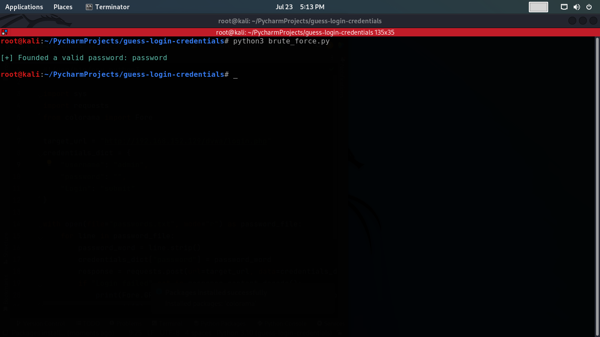

# Guess Login Credentials
This Python script, called "Guess Login Credentials," is a tool designed to attempt to guess the login password for a specified target URL. The script works by trying a list of passwords from a file `(passwords.txt)` and sending login requests to the target URL using the provided credentials dictionary. The script uses the popular `requests` library for handling HTTP requests and the `colorama` library to display colored output on the terminal.

**Disclaimer:** This script is intended for educational and ethical use only. Unauthorized access to systems or services is illegal and unethical. Use this script only with explicit permission from the target and for legitimate security testing purposes.

## How it Works
The script performs the following steps:
1. Imports necessary modules: `sys`, `requests`, and `colorama`.
2. Sets the `target_url` variable to the login page URL of the target application.
3. Defines the `credentials_dict` dictionary, which contains the login credentials to be guessed. The username field is set to a default value of **"admin"**, and the password field will be updated with each password guess from the `passwords.txt` file.
4. Opens the `passwords.txt` file in read mode and iterates through each line, treating each line as a potential password.
5. For each password read from the file, the script updates the `credentials_dict` with the new password and sends an HTTP POST request to the target URL with the updated credentials.
6. The script then checks the response received from the target. If the response does not contain the string **"Login failed"**, it assumes that the login was successful, and the correct password has been found. In this case, the script prints a success message with the valid password and exits with a status code of 0.
7. If none of the guessed passwords work, the script prints a failure message indicating that the password could not be found.

## Prerequisites
Before running the script, ensure you have the following:
- Python 3.x installed on your system.
- The `requests` and `colorama` libraries installed. If you don't have it, you can install it using pip:
    ```commandline
    pip install requests colorama
    ```
  
## Screenshot


## Usage
1. Create a file named `passwords.txt` containing a list of potential passwords, each on a separate line.
2. Modify the target_url variable in the script to the login page URL of the target application.
3. Run the script.

## Disclaimer
This script is provided for educational and ethical purposes only. The author is not responsible for any misuse or damage caused by this script. Use it only with explicit permission from the target and for legitimate security testing purposes.
<br><br>
Always ensure that you have the right to perform security testing on the target application before running this script. Unauthorized access to systems or services is illegal and unethical.
<br><br>
Please use this script responsibly and in compliance with applicable laws and regulations.

